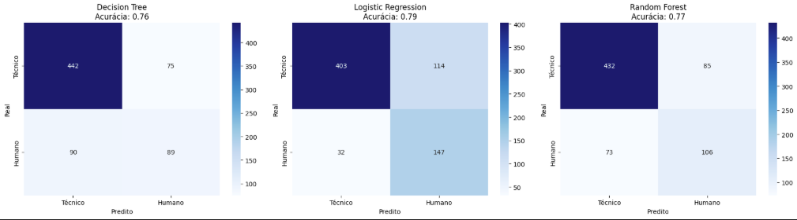
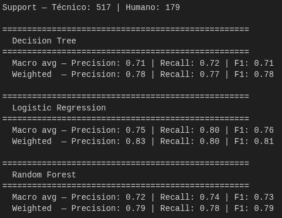
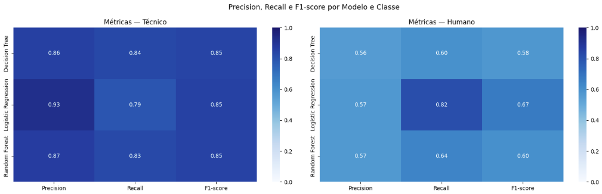
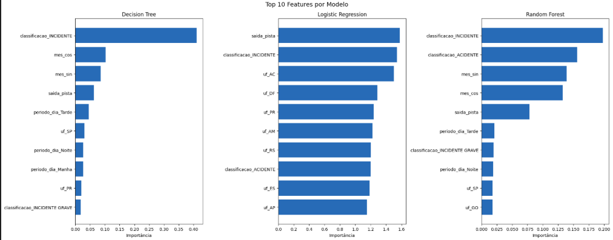

# Flight Analytics BR: Predição de Fator Predominante em Ocorrências Aeronáuticas


Este projeto aplica técnicas de Machine Learning e Engenharia de Dados sobre a base de Ocorrências de Aviação Civil no Brasil (dados públicos do CENIPA). O objetivo é **classificar o fator predominante (Humano ou Técnico)** de uma ocorrência com base em características e metadados operacionais do evento.

---

## Estrutura do Projeto

```
flight-analytics-br/
├── assets/
│   ├── matriz_confusao_acuracia.png
│   ├── heatmap_metricas_por_modelo_e_classe.png
│   ├── relatorio_classificacao_macro_weighted.png
│   └── top10_features_por_modelo.png
├── data/
│   └── ocorrencias_aviacao_civil_br.zip
├── notebooks/
│   └── Flight_Analytics_BR.ipynb
├── .gitignore
├── LICENSE
├── README.md
└── requirements.txt
```

---

## O Desafio

Acidentes e incidentes aéreos são eventos complexos com causas multifatoriais. O desafio deste projeto foi lidar com um dataset desbalanceado, com significativamente mais casos técnicos do que humanos, e extrair padrões estatísticos de variáveis categóricas e temporais, evitando *data leakage*.

Vale ressaltar que o dataset disponível registra predominantemente metadados administrativos das ocorrências, não as características operacionais que definem a causa raiz de um acidente. O modelo identifica correlações estatísticas, mas não estabelece relações de causalidade.

---

## Dados

O dataset utilizado é de domínio público, disponibilizado pelo [CENIPA](https://dados.gov.br/dados/conjuntos-dados/ocorrencias-aeronauticas-da-aviacao-civil-brasileira) e também acessível pelo [Kaggle](https://www.kaggle.com/datasets/ronnycfs/ocorrencias-aviacao-civil-brasileira).

### Variáveis utilizadas no modelo

| Coluna original | Coluna resultante | Transformação |
|---|---|---|
| `ocorrencia_classificacao` | `classificacao` | Renomear + OneHotEncoder |
| `ocorrencia_uf` | `uf` | Renomear + OneHotEncoder |
| `ocorrencia_dia` | `mes_sin`, `mes_cos` | Codificação cíclica (seno/cosseno) |
| `ocorrencia_horario` | `periodo_dia` | Mapeamento para Madrugada/Manhã/Tarde/Noite + OneHotEncoder |
| `total_aeronaves_envolvidas` | `total_aeronaves` | Renomear |
| `ocorrencia_saida_pista` | `saida_pista` | Converter SIM/NÃO para 1/0 |

### Definição do target: `fator_predominante`

A coluna `ocorrencia_tipo_categoria` foi usada para derivar o target do modelo:

**Humano (1):** `PERDA DE CONTROLE EM VOO`, `PERDA DE CONTROLE NO SOLO`, `MANOBRA ABRUPTA`, `OPERAÇÃO A BAIXA ALTITUDE`, `MÉDICO`

**Técnico (0):** `FALHA OU MAU FUNCIONAMENTO DO MOTOR`, `FALHA OU MAU FUNCIONAMENTO DE SISTEMA / COMPONENTE`, `FOGO/FUMAÇA (SEM IMPACTO)`

Demais categorias foram classificadas como `Outros` e excluídas do treinamento por ambiguidade. Após o filtro, o dataset ficou com **2.585 registros Técnico** e **894 registros Humano**, resultando em um desbalanceamento de 74.3% / 25.7%.

---

## Pipeline de Dados e Pré-processamento

1. **Feature Selection:** Remoção de variáveis que geram *data leakage*, como `ocorrencia_tipo` e `ocorrencia_tipo_icao`, mantendo apenas dados conhecidos no momento da ocorrência.

2. **Tratamento de valores sentinela:** O dataset utiliza `"***"` como valor sentinela para dados ausentes em colunas categóricas. Foram identificados 3 registros com esse padrão na coluna `uf`, que foram removidos antes do treinamento.

3. **Feature Engineering:**
   - Mapeamento de horários para **Períodos do Dia** (Madrugada, Manhã, Tarde, Noite), pois cada período tem comportamento operacional distinto, tornando o OneHotEncoder mais adequado que a codificação cíclica neste caso.
   - **Codificação Cíclica** (Seno/Cosseno) para os meses do ano, preservando a adjacência entre Dezembro e Janeiro.

4. **Tratamento de Dados Categóricos:** Uso de `OneHotEncoder` com `handle_unknown='ignore'`, aplicado após o split para evitar leakage do conjunto de teste.

5. **Balanceamento de Classes com SMOTE-NC:** Uso do **SMOTE-NC**  aplicado exclusivamente nos dados de treino após o split. O SMOTE-NC respeita a natureza das variáveis categóricas, copiando valores reais de vizinhos próximos em vez de interpolar linearmente entre categorias, evitando a geração de exemplos sintéticos impossíveis como uma ocorrência "40% em SP e 60% no RJ".

---

## Modelagem e Resultados

Foram avaliados três algoritmos com abordagens matemáticas complementares: **Decision Tree**, **Random Forest** e **Logistic Regression**, todos treinados com hiperparâmetros padrão do sklearn para garantir uma comparação justa sem viés de tuning.

### Matriz de Confusão e Acurácia

A Regressão Logística obteve o melhor desempenho geral (**80% de Acurácia**), com o menor número de falsos negativos (33) para a classe `Humano`, que é a classe de maior interesse para segurança aérea.



### Relatório de Classificação

O recall de **0.82** da Regressão Logística para fatores Humanos demonstra que o modelo identifica corretamente 82% dos casos humanos. Para o contexto de segurança aérea, minimizar falsos negativos é prioritário: é preferível investigar um caso técnico suspeito do que deixar um caso humano sem identificação.




### Comparativo final dos modelos

| Modelo | Acurácia | F1 Técnico | F1 Humano | Macro avg |
|---|---|---|---|---|
| Decision Tree | 0.77 | 0.85 | 0.58 | 0.71 |
| Logistic Regression | **0.80** | 0.85 | **0.67** | **0.76** |
| Random Forest | 0.78 | 0.85 | 0.60 | 0.73 |

### Importância das Features

As features mais relevantes de forma consistente entre os três modelos foram `classificacao_INCIDENTE`, `mes_cos`/`mes_sin` e `saida_pista`. Isso indica que o tipo de classificação da ocorrência, a sazonalidade e a saída de pista são os sinais mais informativos para distinguir fator humano de técnico neste dataset.



---

## Como Executar o Projeto Localmente

1. **Clone o repositório:**
   ```bash
   git clone https://github.com/queirogaraffael/flight-analytics-br.git
   cd flight-analytics-br
   ```

2. **Crie e ative o ambiente virtual:**
   ```bash
   python3 -m venv .venv
   source .venv/bin/activate  # Linux/Mac
   # ou
   .venv\Scripts\activate  # Windows
   ```

3. **Instale as dependências:**
   ```bash
   pip install -r requirements.txt
   ```

4. **Execute o notebook:**
   O dataset já está incluso no repositório dentro da pasta `data/`. Basta abrir `notebooks/Flight_Analytics_BR.ipynb` no Jupyter Notebook e executar as células em ordem.

---

## Limitações

Este projeto é um **exercício analítico baseado em dados disponíveis**. As variáveis utilizadas são metadados administrativos, não características operacionais que definem a causa raiz de um acidente. O modelo identifica correlações estatísticas entre os dados e o target construído, mas não estabelece relações causais com as causas reais dos acidentes.

Limitações específicas incluem ausência de dados sobre experiência do piloto, condições meteorológicas detalhadas, histórico de manutenção da aeronave e fase do voo, variáveis que teriam alto valor preditivo para o objetivo do projeto.

---

## Conclusão

Este projeto demonstrou que é perfeitamente viável extrair padrões analíticos e criar modelos preditivos funcionais a partir de metadados administrativos de ocorrências aéreas. 

A adoção do **SMOTE-NC** provou ser uma decisão arquitetural crucial para evitar a distorção das variáveis categóricas, permitindo que o modelo aprendesse padrões reais em vez de ruídos matemáticos. Dentre os modelos avaliados, a **Regressão Logística** entregou o melhor resultado prático para o contexto do problema, alcançando **80% de acurácia geral** e um excelente **recall de 82%** para a classe minoritária (Fator Humano). 

Apesar de as árvores de decisão e o ensemble (Random Forest) serem teoricamente mais robustos para variáveis de alta cardinalidade, a natureza do dataset, somada à interpolação linear inevitável em variáveis numéricas durante o balanceamento, acabou favorecendo o modelo linear. Em suma, o projeto atinge seu objetivo ao apresentar um pipeline analítico maduro, com justificativas claras para cada etapa de engenharia de dados.

---

## Contribuições

Contribuições são bem-vindas. Sinta-se à vontade para fazer um *fork* do repositório, sugerir melhorias ou enviar um Pull Request.

---

## Licença

Este projeto está licenciado sob a [Licença MIT](LICENSE).
